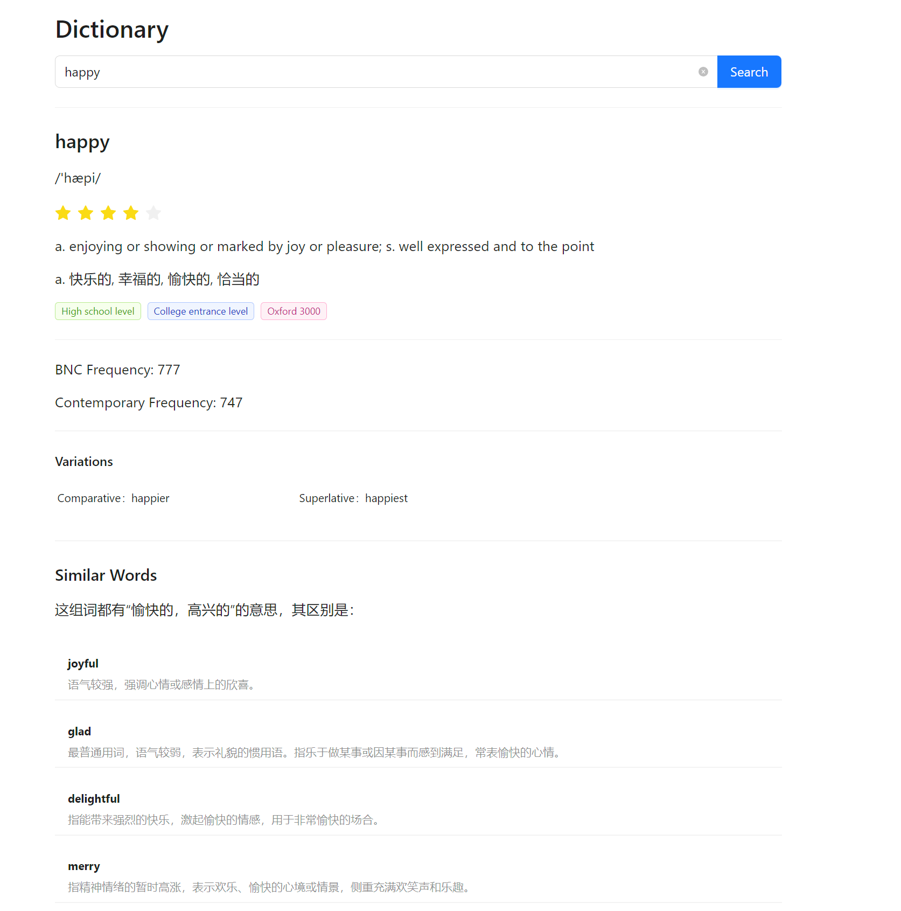

# ecdict

[](https://www.npmjs.com/package/ecdict)


ECDict: JavaScript 免费的英汉词典数据集。

数据来源：[skywind3000/ECDICT](https://github.com/skywind3000/ECDICT).

包含大约 200M 数据（安装后的大小）。

不适用于浏览器。

[English Documentation](docs/README.en.md)

[Online Demo](https://koto-noha.web.app/dict)

## :framed_picture: Gallery



## :green_book: 目录

1. [开始使用](#开始使用)
2. [查询单词](#查询单词)
3. [搜索原型](#搜索原型)

## 开始使用

```bash
npm i ecdict
```

数据集将于安装后生成于 `node_modules/ecdict/data`.

## 查询单词

```js
import { searchWord } from "ecdict";

searchWord("happy", {
  withResemble: true,
  withRoot: true,
  caseInsensitive: true,
});
```

### 参数

| Name    | Type   | Description          |
| ------- | ------ | -------------------- |
| entry   | string | 必须，所查询的单词。 |
| options | object | 可选，参见下表。     |

#### Options

| Name            | Type    | Description        |
| --------------- | ------- | ------------------ |
| withResemble    | boolean | 可选，包含相似词汇 |
| withRoot        | boolean | 可选，进行词根搜索 |
| caseInsensitive | boolean | 可选，大小写不敏感 |

### 输出

| Name        | Type   | Description                                                |
| ----------- | ------ | ---------------------------------------------------------- |
| entry       | string | 输入的查询词                                               |
| lemma       | string | 其原型                                                     |
| word        | string | 词典中对应的单词                                           |
| definition  | string | 英文释义                                                   |
| translation | string | 中文释义                                                   |
| frequency   | number | 词频                                                       |
| level       | number | 以幼稚方式计算出的 1~10 之间的词语难度等级                 |
| exchange    | string | 其变化形                                                   |
| phonetic    | string | 音标                                                       |
| pos         | string | 词语位置，用 "/" 分割不同位置                              |
| collins     | string | 柯林斯星级                                                 |
| oxford      | string | 是否是牛津三千核心词汇                                     |
| tag         | string | 字符串标签：zk/中考，gk/高考，cet4/四级 等等标签，空格分割 |
| bnc         | string | 英国国家语料库词频顺序                                     |
| frq         | string | 当代语料库词频顺序                                         |
| resemble    | object | 参见下表                                                   |
| root        | object | 参见下表                                                   |

更多信息参见：[skywind3000/ECDICT](https://github.com/skywind3000/ECDICT)

#### resemble

| Name        | Type     | Description |
| ----------- | -------- | ----------- |
| synonyms    | string[] | 近义词列表  |
| description | string   | 描述        |
| dict        | object   | 参见下表    |

##### resemble.dict

| Name       | Type   | Description |
| ---------- | ------ | ----------- |
| word       | string | 单词        |
| definition | string | 中文释义    |

#### root

| Name     | Type     | Description |
| -------- | -------- | ----------- |
| root     | string[] | 词根列表    |
| synonyms | string[] | 近义词列表  |
| antonyms | string[] | 反义词列表  |
| class    | string   | 词根类型    |
| examples | string[] | 例词        |
| meaning  | string   | 英文释义    |
| function | string   | 功能        |
| origin   | string   | 语源        |

## 搜索原型

```js
import { findLemma } from "ecdict";

findLemma("burns", true);
```

### 参数

| Name            | Type    | Description        |
| --------------- | ------- | ------------------ |
| word            | string  | 必须，所搜索的单词 |
| caseInsensitive | boolean | 可选，大小写不敏感 |

### 输出

| Name      | Type   | Description                                |
| --------- | ------ | ------------------------------------------ |
| word      | string | 原型                                       |
| frequency | number | 词频                                       |
| level     | number | 以幼稚方式计算出的 1~10 之间的词语难度等级 |
